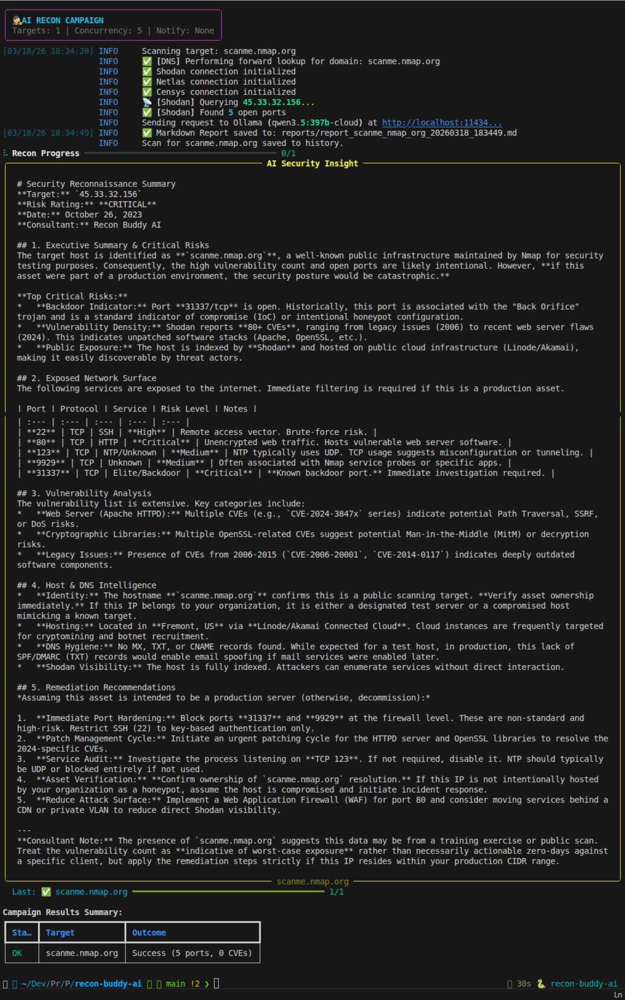

[](https://RyanMaxie.tech)

# 🚀 Recon Buddy AI

> Automated recon for the modern security pro. Wraps Nmap, Shodan, and DNS utils into one Python tool, then uses AI to summarize the attack surface so you don't have to parse XML manually. Generates clean reports instantly. Stop staring at terminal output and let the bot explain it.

[](https://opensource.org/licenses/MIT)
[](http://makeapullrequest.com)
[](https://www.python.org/)
[](https://ollama.com/)


---

## 🧐 What is this?

A command-line utility designed for modern security professionals and bug bounty hunters, Recon Buddy AI addresses the critical challenge of sifting through vast amounts of raw reconnaissance data. It automates the collection of network intelligence from multiple sources like Nmap, Shodan, Netlas, and Censys, and then leverages an AI model to synthesize this complex data into actionable, concise summaries, significantly reducing manual analysis time and streamlining the reporting process.

---

## 🛠️ Tech Stack

| Component | Technology | Key Libraries/Frameworks |
| :--- | :--- | :--- |
| **Core Language** | Python | Python 3.11+ |
| **Network Scanning** | python-nmap | Nmap |
| **DNS Utilities** | dnspython | |
| **OSINT/Threat Intel** | Shodan, Netlas, Censys, Criminal IP | shodan, netlas, censys |
| **Vulnerability Data** | NVD API | vuln_lookup.py |
| **AI/LLM** | Ollama | ollama (default: llama3) |
| **CLI/UI** | Rich | rich |
| **Configuration** | python-dotenv | python-dotenv |
| **Templating** | Jinja2 | jinja2 |
| **Package Manager** | Poetry | poetry |

---

## 📦 Project Structure

```plain
recon-buddy-ai/
│
├── LICENSE
├── README.md
├── assets/
│   └── images/
│       └── recon-buddy-ai-screenshot.png
├── log_config.py
├── main.py
├── modules/
│   ├── __init__.py
│   ├── ai_summarizer.py
│   ├── dns_module.py
│   ├── history.py
│   ├── notifiers.py
│   ├── reporter.py
│   ├── scanner.py
│   └── vuln_lookup.py
├── poetry.lock
├── pyproject.toml
├── requirements.txt
└── .env.example
```

---

## 🚀 Quick Start

The following instructions are optimized for a Linux environment (Ubuntu/Debian).

### Prerequisites

You must have **Python 3.11+** and **Poetry** (or pip) installed. Additionally, **Ollama** must be running locally or accessible via `OLLAMA_HOST` for AI summarization.

1.  **Clone the repository**

    ```bash
    git clone https://github.com/RyanMaxiemus/recon-buddy-ai.git
    cd recon-buddy-ai
    ```

2.  **Configure Environment Variables**

    Create a file named `.env` in the root of the project directory by copying the example file, and populate it with your API keys. Ensure your Ollama instance is running and accessible.

    ```bash
    cp .env.example .env
    # Open the .env file and add your keys, e.g.:
    # SHODAN_API_KEY="your_shodan_api_key_here"
    # NETLAS_API_KEY="your_netlas_api_key_here"
    # CRIMINAL_IP_API_KEY="your_criminal_ip_api_key_here"
    # CENSYS_API_ID="your_censys_api_id_here"
    # CENSYS_API_SECRET="your_censys_api_secret_here"
    # NVD_API_KEY="your_nvd_api_key_here"
    # OLLAMA_MODEL="llama3" # Optional, defaults to llama3
    # OLLAMA_HOST="http://localhost:11434" # Optional, defaults to localhost
    ```

3.  **Install Dependencies**

    Install all necessary Python dependencies using Poetry.

    ```bash
    poetry install
    ```

    Alternatively, if you prefer pip:

    ```bash
    pip install -r requirements.txt
    ```

4.  **Run the Application**

    Launch Recon Buddy AI to scan a target.

    ```bash
    poetry run python main.py --target example.com
    ```

    Or with pip:

    ```bash
    python main.py --target example.com
    ```

    Replace `example.com` with your desired target IP, CIDR, or domain. Use `--help` for more options.

## 📸 Preview



## 🤝 Contributing

Found a bug? Have an idea for a new feature, or a better way to handle the automated reconnaissance workflow? We welcome all contributions!

1.  **Open an Issue:** Before submitting a Pull Request, please open an issue to discuss the bug or feature you're working on. This helps prevent duplicate work and ensures alignment with the project's goals.
2.  **Fork and Branch:** Fork the repository and create a new branch for your contribution.
3.  **Code and Commit:** Write clean, well-documented code. Commit messages should be descriptive and follow a conventional format (e.g., `feat: add dark mode toggle`).
4.  **Submit a PR:** Submit a Pull Request against the `main` branch. I'll review it as quickly as possible.

Let's make Recon Buddy AI the most intelligent and efficient reconnaissance tool available, together.
